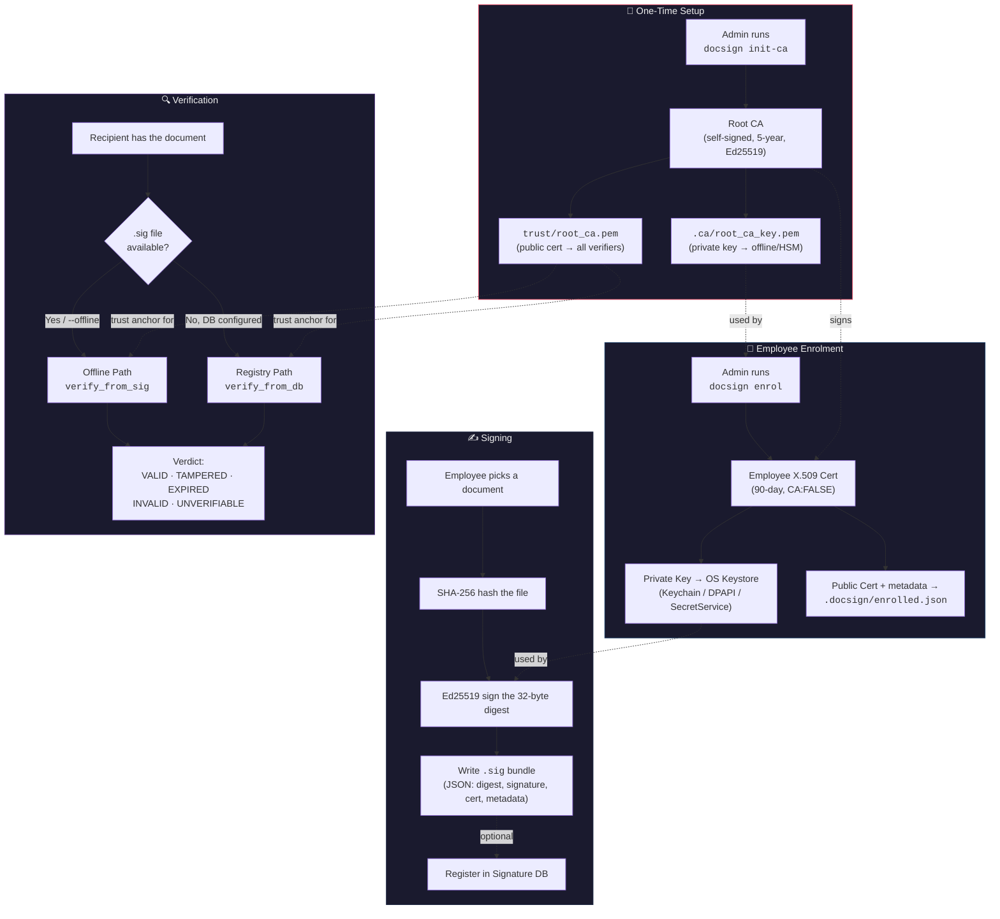
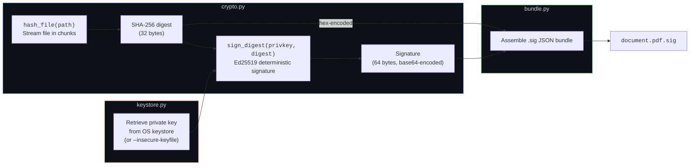
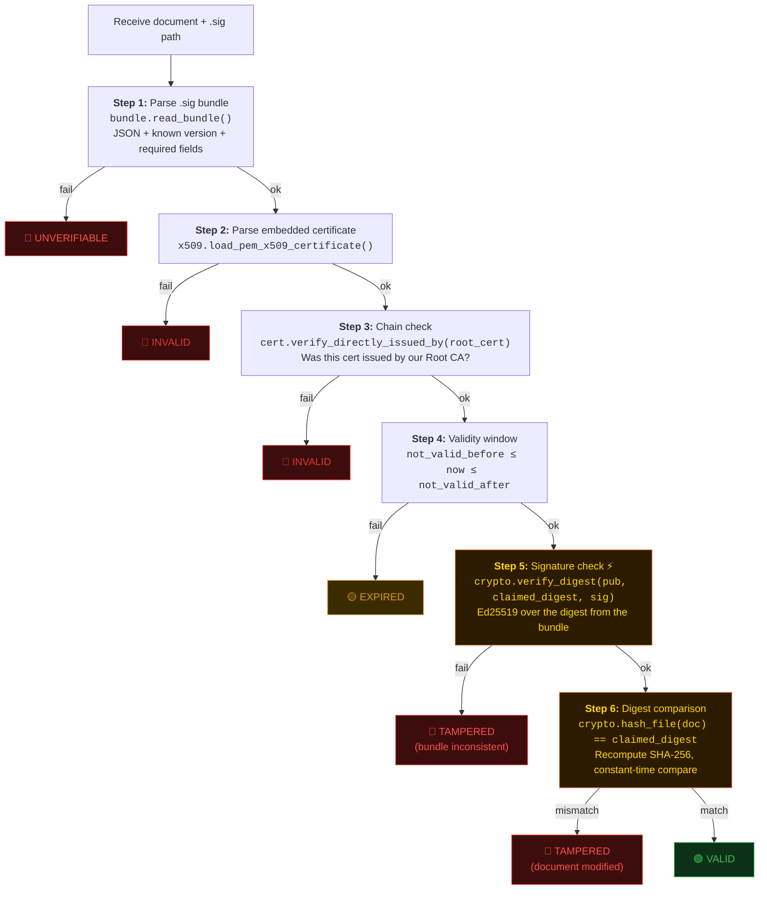
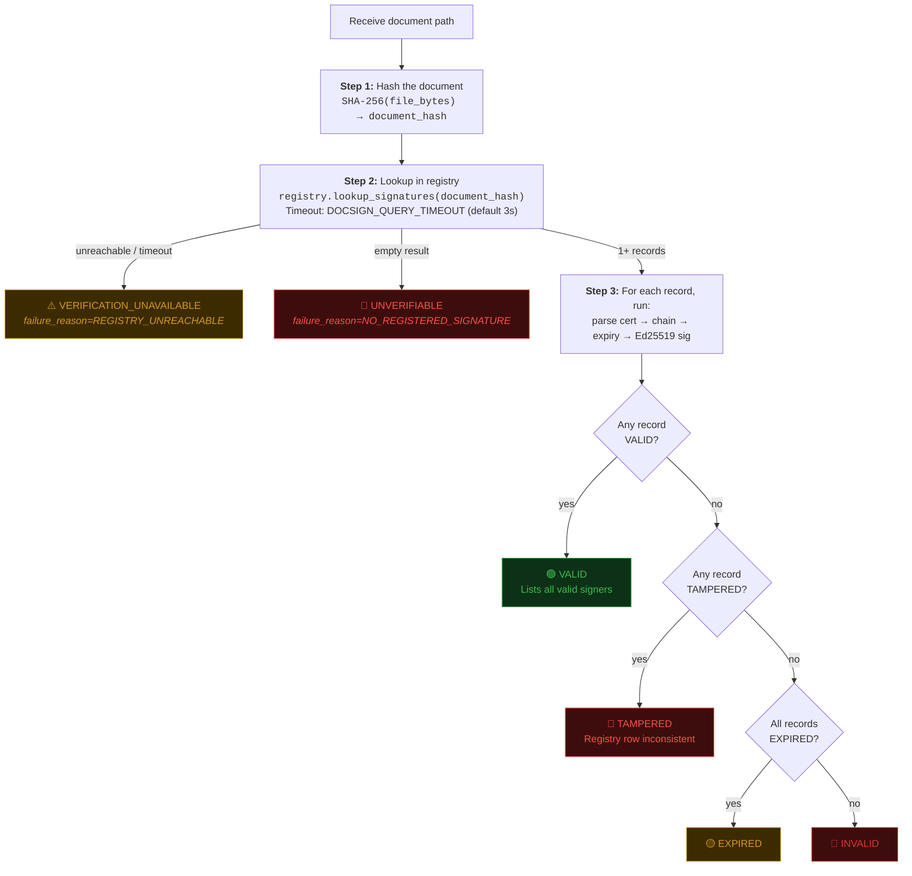
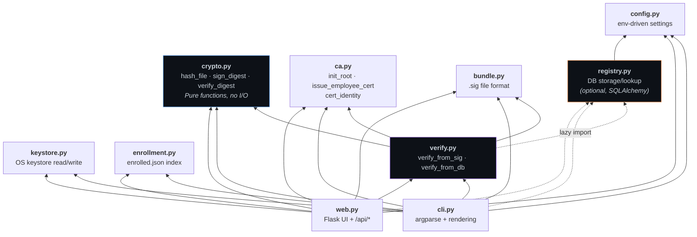

# docsign — Technical Pipeline Overview

---

## High-Level Pipeline

A bird's-eye view of the entire system — what flows where, and who trusts whom.



### Summary

| Stage | Input | Output | Key Trust Property |
|---|---|---|---|
| **Init CA** | Admin command | Root keypair + public cert | Single trust anchor for entire org |
| **Enrol** | Name, email, employee ID | 90-day X.509 cert + private key in keystore | Identity bound to key by admin |
| **Sign** | Document file + employee key | Detached `.sig` JSON bundle | Digest signed, not file — O(1) in doc size |
| **Verify** | Document + `.sig` (or DB lookup) | Structured `VerificationResult` | Zero network calls on offline path |

---

## Low-Level Technical Pipeline

### Signing Pipeline (Detail)



#### `.sig` Bundle Structure
```json
{
  "version": 1,
  "algorithm": "Ed25519",
  "hash": "SHA-256",
  "digest": "<hex SHA-256(document bytes)>",
  "signature": "<base64 Ed25519(private_key, raw_digest_bytes)>",
  "certificate": "<PEM employee X.509 cert>",
  "signed_at": "2026-09-10T14:03:22Z",
  "filename": "invoice_q3.pdf"
}
```

> [!IMPORTANT]
> `signed_at` and `filename` are **informational only** — never trusted in verification decisions. The signature covers the raw digest bytes, not the hex string.

---

### Offline Verification Pipeline (`verify_from_sig`)

Each step short-circuits on failure. The step ordering is security-critical.



> [!CAUTION]
> **Step 5 MUST run before Step 6.** The Ed25519 signature is what makes the bundle's `digest` field trustworthy. If you compare digests first, an attacker who controls the `.sig` can substitute any digest they like — the comparison would pass before the signature check catches the forgery. This ordering is enforced by [test_attacks.py case 10](file:///c:/Users/Uday Raj Malik/Desktop/docPipeline/Gadbad-Ghotala/tests/test_attacks.py).

---

### Registry Verification Pipeline (`verify_from_db`)

Used when `DOCSIGN_DATABASE_URL` is set and no `--offline` flag is given.



> [!NOTE]
> A hash miss in the registry **cannot** be distinguished from "never signed" — it's always `UNVERIFIABLE`, never `TAMPERED`. `TAMPERED` in DB mode means a stored signature failed its own cryptographic check (a corrupted registry row), which is a different claim than "the document was modified after signing."

---

### Module Dependency Graph

How the source modules call each other at runtime.



---

### Exit Code Map

Stable contract — scripts and CI integrations depend on these.

| Exit Code | Status | Meaning |
|:---------:|--------|---------|
| `0` | `VALID` | Signature checks out, document unchanged |
| `1` | `TAMPERED` | Known signer, document modified post-signing |
| `2` | `UNVERIFIABLE` | No signature found at all |
| `3` | `EXPIRED` | Certificate outside validity window |
| `4` | `INVALID` | Certificate doesn't chain to trusted root |
| `5` | `VERIFICATION_UNAVAILABLE` | Registry unreachable (operational, not cryptographic) |

---

### Key Security Invariants

| Invariant | Enforced By |
|---|---|
| Verification makes **zero network calls** | [test_verify.py::test_verification_makes_no_network_calls](file:///c:/Users/Uday Raj Malik/Desktop/docPipeline/Gadbad-Ghotala/tests/test_verify.py) |
| Signature check (step 5) before digest comparison (step 6) | [test_attacks.py case 10](file:///c:/Users/Uday Raj Malik/Desktop/docPipeline/Gadbad-Ghotala/tests/test_attacks.py) |
| Chain check (step 3) before signature check (step 5) | [test_attacks.py case 13](file:///c:/Users/Uday Raj Malik/Desktop/docPipeline/Gadbad-Ghotala/tests/test_attacks.py) |
| Digest comparison uses constant-time `hmac.compare_digest` | [crypto.py::digests_equal](file:///c:/Users/Uday Raj Malik/Desktop/docPipeline/Gadbad-Ghotala/src/docsign/crypto.py) |
| Private keys never logged or serialized | Convention in keystore.py / crypto.py |
| `verify_digest()` rejects private keys | [test_crypto.py](file:///c:/Users/Uday Raj Malik/Desktop/docPipeline/Gadbad-Ghotala/tests/test_crypto.py) |
